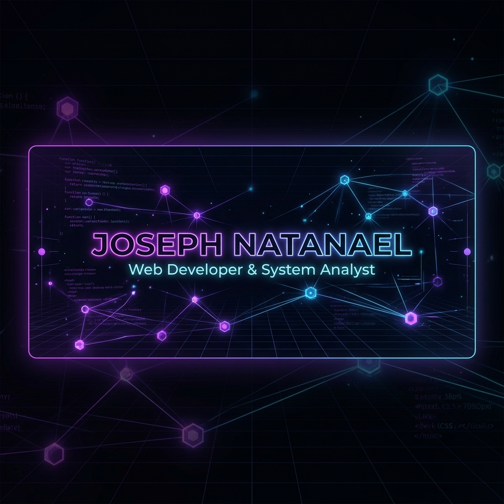

  

<h1 align="center">Hi there! I'm Joseph Natanael Morasa 👋</h1>

  <strong>Bachelor of Information Systems | Web Developer & System Analyst</strong>

  
  
  
  

---

### 🚀 About Me

I am an **Information Systems graduate** from **Dinamika University (Stikom Surabaya)** with a GPA of **3.80 / 4.00**. I specialize in building web-based business systems and process automation. 

- 💻 Passionate about **Backend Development, System Analysis, and Database Management**.
- 🛠️ Extensive experience in developing automated systems like **Inventory Management, Purchasing, and Performance Evaluation**.
- 📚 Continuous learner focused on creating clean, responsive, and robust applications.

---

### 🛠️ Tech Stack & Skills

To maintain visual excellence, all tools and languages are presented in a unified, professional dark-tech aesthetic:

| Category | Technologies |
| :--- | :--- |
| **Languages** |      |
| **Frameworks & Libraries** |     |
| **Databases** |   |
| **Tools & Platforms** |      |
| **Core Concepts** | `CRUD Systems` • `Process Automation` • `Reporting Systems` • `Inventory Management` • `System Analysis` |

---

### 💼 Professional Experience

#### 💻 Freelance Developer — Poltekkes Kemenkes Surabaya
*__Mar 2026 – May 2026__*
- Developed a **Laboratory Inventory Management System** to centralize equipment, materials, and operation records.
- Built lending modules, booking modules, automated inventory recommendations, and transaction reports.
- *Tech Stack:* `PHP` • `MySQL` • `JavaScript` • `Bootstrap`

#### 💻 Freelance Developer — Sekolah Kristen Permata Hati
*__Nov 2025 – Jan 2026__*
- Built a **Teacher Performance Evaluation System** using KPI and 360-degree assessment methodologies.
- Automated scoring and performance calculations, and generated PDF-based evaluation summaries.
- *Tech Stack:* `Laravel` • `PHP` • `MySQL` • `Bootstrap` • `JavaScript`

#### ⚙️ Intern Web Developer — CV Adi Jaya Mandiri
*__Feb 2025 – May 2025__*
- Assisted in developing and maintaining web-based applications to support operational processes.
- Collaborated on implementing requirements into application features, debugging, and database management.
- *Tech Stack:* `PHP` • `MySQL` • `JavaScript` • `HTML` • `CSS`

---

### ⚡ Featured Projects

#### 📂 [Teacher Performance Evaluation System](https://github.com/JosephNatanael/KPI-Guru-360)
> A web-based performance evaluation system using KPI and 360-degree assessment methods. It features automated scoring, centralized monitoring, and custom PDF report generation.
>
> **Tech Stack:** `Laravel` • `PHP` • `MySQL` • `Bootstrap` • `JavaScript`

#### 📂 [Laboratory Inventory Management System](http://sistemlab-tlm-polkesbaya.com)
> A comprehensive system built for Poltekkes Kemenkes Surabaya featuring inventory tracking, lending/booking modules, and critical stock level recommendations.
>
> **Tech Stack:** `PHP` • `MySQL` • `JavaScript`

#### 📂 [Construction Material Purchasing System](https://github.com/JosephNatanael/konstruksi-app)
> A procurement and purchasing management application for material transactions. Features custom Safety Stock calculations for stock replenishments and automated transaction reports.
>
> **Tech Stack:** `PHP` • `MySQL` • `Bootstrap` • `JavaScript`

---

### 📈 GitHub Stats & Activity

  
  &nbsp;&nbsp;
  

  

---

### 🕹️ Mini Arcade Corner

  <picture>
    <source media="(prefers-color-scheme: dark)" srcset="https://raw.githubusercontent.com/JosephNatanael/JosephNatanael/output/pacman-contribution-graph-dark.svg">
    <source media="(prefers-color-scheme: light)" srcset="https://raw.githubusercontent.com/JosephNatanael/JosephNatanael/output/pacman-contribution-graph.svg">
    
  </picture>

